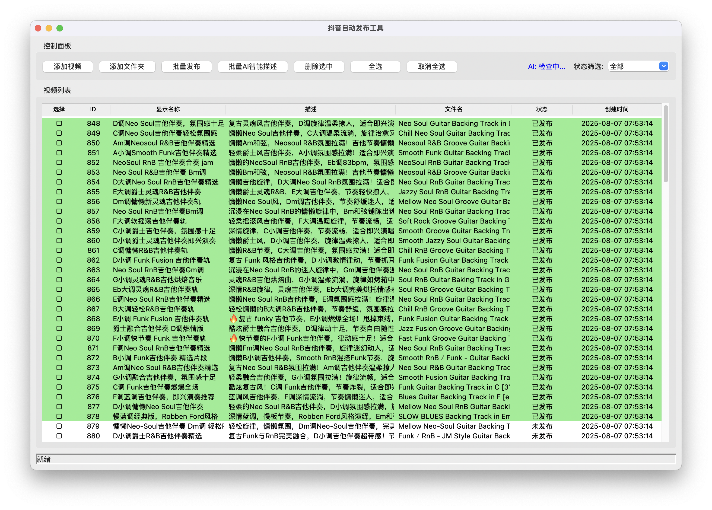

# 视频管理系统

一个用于自动化批量发布视频到抖音和B站的桌面应用程序。

> **致谢**: 本项目部分功能参考了 [social-auto-upload](https://github.com/dreammis/social-auto-upload) 开源项目，感谢原作者 [dreammis](https://github.com/dreammis) 的贡献。



## 功能特性

### 核心功能
- ✅ **视频管理**: 添加多个视频到本地数据库
- ✅ **批量添加**: 支持多文件选择和文件夹批量添加
- ✅ **智能命名**: 支持Ollama本地模型批量智能命名
- ✅ **AI描述生成**: 自动生成视频描述，支持人工编辑
- ✅ **AI标题生成**: 基于qwen3:8b模型智能生成视频标题，自动清理`<think>`标签
- ✅ **状态筛选**: 支持按发布状态筛选（未发布/已发布/发布失败）
- ✅ **多选操作**: 支持多选勾选，批量操作
- ✅ **批量发布**: 支持选择的视频批量发布（模拟功能）
- ✅ **非阻塞UI**: 执行过程中避免UI阻塞

### 界面功能
- 📁 **文件选择**: 支持多种视频格式（mp4, avi, mov, mkv, wmv, flv）
- 📋 **视频列表**: 显示视频信息，包括ID、显示名称、文件名、描述、状态、创建时间
- 🎨 **颜色区分**: 已发布视频显示绿色背景，发布失败显示红色背景，未发布显示正常颜色
- ✏️ **编辑功能**: 双击视频条目可编辑视频信息
- 🔍 **筛选功能**: 按状态筛选视频列表
- ☑️ **多选功能**: 点击复选框选择/取消选择视频
- 🚀 **批量操作**: 全选/取消全选，批量发布，批量重命名

> 💡 **界面预览**: 上图展示了应用的主要界面，包括视频列表、操作按钮和状态筛选功能。

## 安装和运行

### 环境要求
- Python 3.7+
- tkinter (通常随Python一起安装)

### 安装步骤

1. 克隆或下载项目文件
2. 安装依赖包：
```bash
pip install -r requirements.txt
```

3. 运行程序：
```bash
python video_manager_improved.py
```

## 使用说明

### 添加视频
1. **单个添加**: 点击"添加视频"按钮，选择要添加的视频文件（支持多选）
2. **批量添加**: 点击"添加文件夹"按钮，选择包含视频的文件夹，系统会自动扫描并添加所有支持的视频文件
3. 系统会自动将视频信息添加到数据库，并显示添加结果
4. 重复文件会被自动跳过

### 编辑视频信息
1. 双击视频列表中的任意条目
2. 在弹出的编辑窗口中修改：
   - 显示名称
   - 描述
   - 发布状态
3. 可以使用"AI生成名称"和"AI生成描述"按钮
4. 点击"保存"确认修改

### 批量操作
1. **选择视频**: 
   - 点击复选框选择单个视频
   - 使用"全选"/"取消全选"按钮
2. **批量发布**: 选择视频后点击"批量发布"（目前为模拟功能）
3. **批量重命名**: 选择视频后点击"批量重命名"生成AI名称

### 筛选功能
- 使用右上角的状态筛选下拉框
- 可选择：全部、未发布、已发布、发布失败

## 数据库结构

系统使用SQLite数据库存储视频信息：

```sql
CREATE TABLE videos (
    id INTEGER PRIMARY KEY AUTOINCREMENT,
    filename TEXT NOT NULL,           -- 原始文件名
    display_name TEXT NOT NULL,       -- 显示名称（可编辑）
    file_path TEXT NOT NULL,          -- 文件完整路径
    description TEXT,                 -- 视频描述
    status TEXT DEFAULT '未发布',      -- 发布状态
    created_at TIMESTAMP DEFAULT CURRENT_TIMESTAMP,
    updated_at TIMESTAMP DEFAULT CURRENT_TIMESTAMP
);
```

## 技术特点

### 界面设计
- 使用tkinter构建现代化GUI界面
- 响应式布局，支持窗口大小调整
- 树形视图显示视频列表，支持滚动
- 状态栏显示操作进度

### 数据处理
- SQLite数据库存储，轻量级且无需额外配置
- 支持视频文件路径管理
- 自动生成时间戳

### 用户体验
- 非阻塞操作，长时间任务在后台执行
- 操作确认对话框，防止误操作
- 实时状态更新
- 直观的复选框选择机制

## 扩展功能

### AI集成
当前版本包含AI功能的框架，可以轻松集成Ollama API：

```python
def generate_ai_description(self, filename):
    # 集成Ollama API
    import requests
    response = requests.post('http://localhost:11434/api/generate', 
                           json={'model': 'llama2', 'prompt': f'为视频{filename}生成描述'})
    return response.json()['response']
```

### 发布功能
可以扩展实现真实的发布功能：
- 抖音API集成
- B站API集成
- 发布状态监控
- 错误处理和重试机制

## 文件结构

```
auto-publish/
├── video_manager.py              # 基础版本
├── video_manager_improved.py     # 改进版本（推荐使用）
├── config.py                     # 配置管理
├── demo_data.py                  # 演示数据生成
├── test_system.py                # 系统测试
├── test_batch_add.py             # 批量添加测试
├── run.py                        # 启动脚本
├── requirements.txt              # 依赖包列表
├── README.md                    # 说明文档
├── 项目总结.md                   # 项目总结
├── videos.db                    # SQLite数据库文件（运行后自动生成）
└── config.json                  # 配置文件（运行后自动生成）
```

## 注意事项

1. **文件路径**: 系统会记录视频文件的完整路径，请确保文件位置稳定
2. **数据库**: 数据库文件会自动创建在程序运行目录下
3. **AI功能**: 当前版本使用模拟AI功能，需要手动集成Ollama API
4. **发布功能**: 当前版本为模拟发布，需要集成真实的平台API

## 开发计划

- [x] 集成Ollama API实现真实AI功能
- [x] 实现抖音发布功能
- [ ] 实现B站发布功能
- [ ] 添加视频预览功能
- [ ] 支持视频标签管理
- [x] 添加发布历史记录
- [ ] 支持多平台配置管理

## 致谢

本项目部分功能参考和借鉴了以下开源项目：

### [social-auto-upload](https://github.com/dreammis/social-auto-upload)

本项目在开发过程中参考了 [social-auto-upload](https://github.com/dreammis/social-auto-upload) 项目的部分代码和设计思路，特别是：

- **多平台上传架构**: 借鉴了其模块化的上传器设计
- **Cookie管理机制**: 参考了其用户认证和会话管理方案
- **视频处理流程**: 学习了其视频文件处理和元数据管理方式
- **错误处理策略**: 采用了其完善的异常处理和重试机制

感谢 [dreammis](https://github.com/dreammis) 及其团队为开源社区做出的贡献！

> **开源协议**: social-auto-upload 项目采用 MIT License 开源协议，本项目严格遵循相关开源协议要求。
